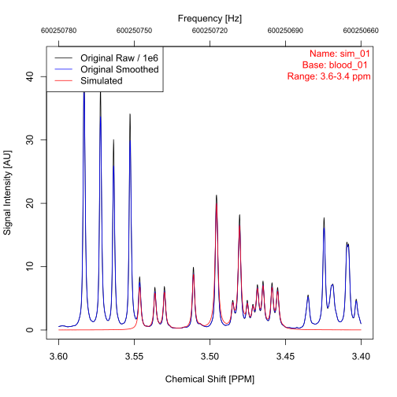

# Datasets

The [metabodeconplus
repository](https://github.com/spang-lab/metabodeconplus) contains a
selection of example datasets. This article describes each of these
datasets in details, i.e.

- which and how many samples are included
- how they were measured
- how you can access the dataset

For package users, the canonical way to access file-based example
datasets is
[`download_example_datasets()`](https://spang-lab.github.io/metabodeconplus/reference/download_example_datasets.md).

## The Blood dataset 

The *blood* dataset contains 16 one-dimensional CPMG NMR-spectra of
human blood plasma in Bruker format. It is not bundled with the package;
it served as the basis for the simulated *sim* dataset described below.

## The Urine dataset 

The *urine* dataset contains two one-dimensional NOESY NMR-spectra of
urine, available in both Bruker and jcamp-dx format. They ship with the
package under
[inst/example_datasets](https://github.com/spang-lab/metabodeconplus/tree/main/inst/example_datasets)
and are accessible via `metabodeconplus_file("bruker/urine")`.

## The Sim dataset 

There are scenarios where it is useful to work with simulated datasets
instead of real data, such as:

- When you need to know the underlying distribution of the data to check
  whether a function works as expected.
- To speed up test cases and examples where a few data points are
  sufficient to test a function.

For such cases, `metabodeconplus` includes a simulated dataset called
*sim*, which was generated by applying the following steps to each
spectrum of the [blood](#blood) dataset:

1.  Deconvolute spectrum using
    [`deconvolute()`](https://spang-lab.github.io/metabodeconplus/reference/deconvolute.md)
    with default parameters
2.  Extract Lorentz curve parameters for all peaks between 3.52 and 3.37
    ppm
3.  Generate 2048 equidistant chemical shift values between 3.59 and
    3.28 ppm[^1]
4.  Calculate the signal intensity at each chemical shift as
    superposition of Lorentz curves
5.  Add random noise to the simulated spectrum [^2]

The first two of the 16 simulated spectra are plotted
[below](#fig-simulated-datasets). For further details about the
simulation process, see the source code of function
[simulate_spectrum()](https://github.com/spang-lab/metabodeconplus/blob/main/R/spec.R).



**Figure:** The first two simulated datasets from the [sim](#sim).

## The AKI dataset 

The *aki* dataset contains 106 one-dimensional urine NMR spectra in
Bruker format from the AKI study by Zacharias et al. (2012). The
measured samples come from a clinical cohort collected 24 hours after
surgery and were analyzed to compare patients who developed acute kidney
injury with those who did not. In this dataset, 72 spectra are labeled
as controls (`Biopsy kidney normal`) and 34 spectra as AKI cases
(`Acute Kidney Injury`).

Within `misc/example_datasets/bruker/aki`, the full phenotypic metadata
is stored in `aki/s_MTBLS24.txt`, and the corresponding spectra are
stored in the remaining sample directories of the `aki` folder.

The phenotype table and spectra files originate from the public
MetaboLights study `MTBLS24`
(<https://www.ebi.ac.uk/metabolights/MTBLS24>). For `metabodeconplus`,
these files are filtered to the relevant subset (phenodata plus required
Bruker files for reading spectra), then packaged into
`example_datasets.zip` and re-distributed as a convenience download.

## How to download datasets

Due to the size constraints for R packages, most of the above mentioned
datasets are not included by default when the package is installed, but
must be explicitly downloaded afterwards. This can be done via command
[`download_example_datasets()`](https://spang-lab.github.io/metabodeconplus/reference/download_example_datasets.md):

``` r

library(metabodeconplus)
# Set persistent = TRUE to store the files at a persistent location. This way,
# the next time you call `download_example_datasets()`, the files will not be
# downloaded again.
path <- download_example_datasets(persistent = FALSE)
tree(path)
```

Spectra that come pre-installed with the package and do not require a
separate download, are:

- All 16 spectra from the [sim](#sim) dataset
- The two spectra from the [urine](#urine) dataset in Bruker format
- The first spectrum from the [urine](#urine) dataset in jcamp-dx format

[^1]: The blood spectra have 131072 datapoints per 20 ppm (14.8 ppm to
    -5.2), i.e. ≈ 2000 datapoints per 0.3 ppm. The Sim spectra also have
    ≈ 2000 datapoints per 0.3 ppm, i.e., the resolution between the two
    datasets is kept constant.

[^2]: The standard deviation (SD) of the noise was calculated as SD of
    signal intensities from the signal free region.
