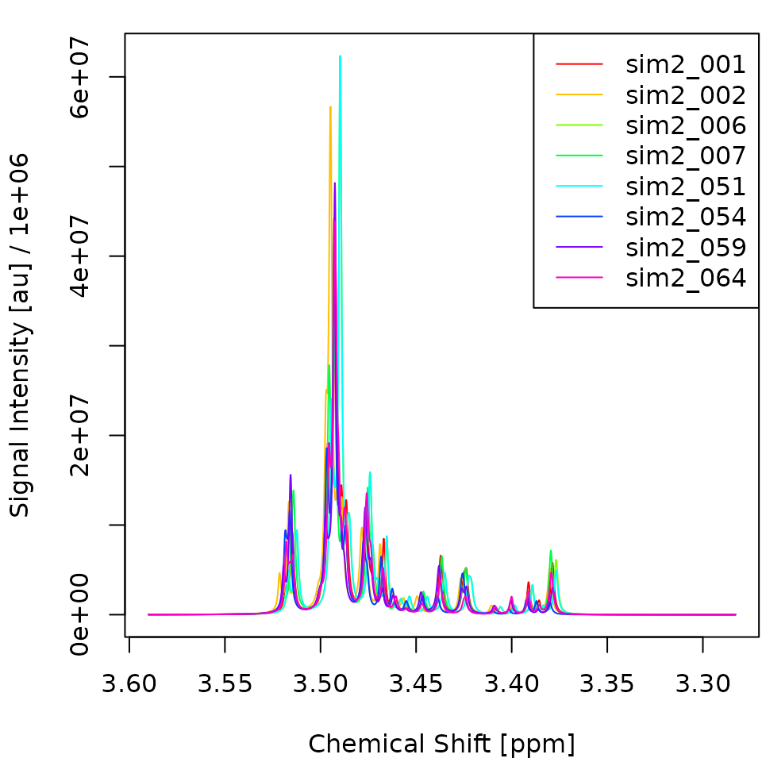
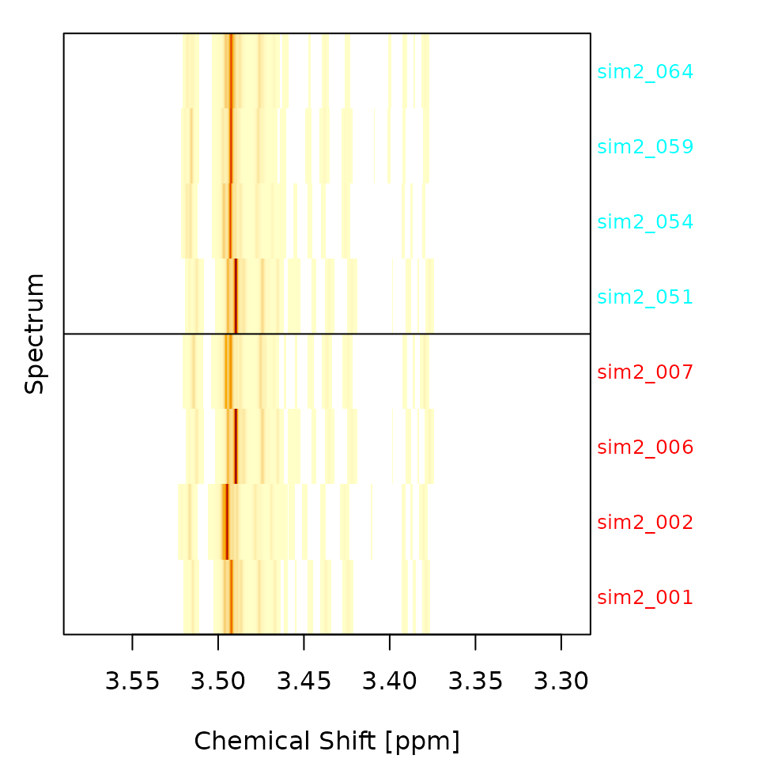
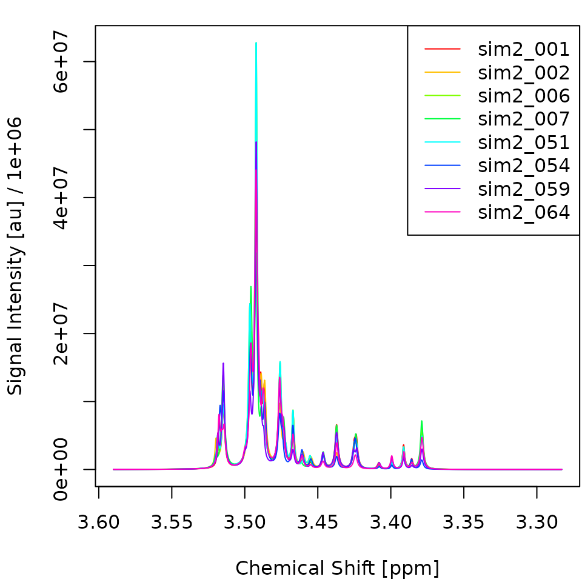
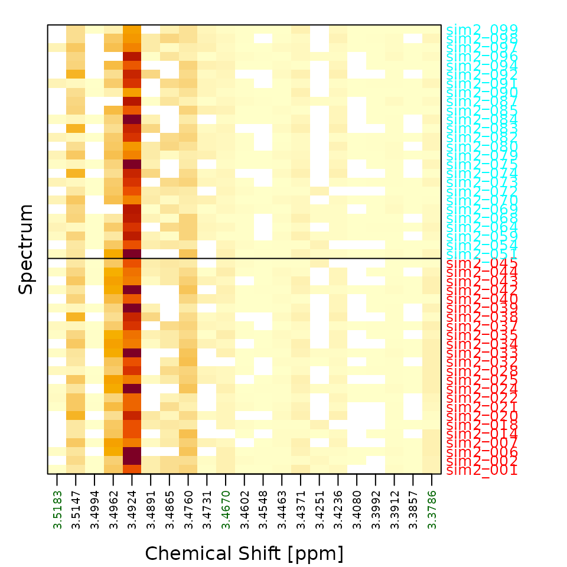
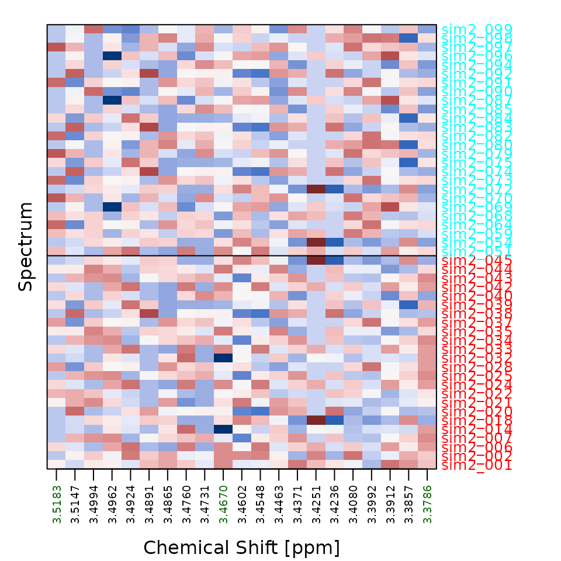

# Model Fitting

This article shows how to turn raw one-dimensional NMR spectra into a
trained classifier with `metabodeconplus`, following the same pipeline
described in the paper:

1.  **Deconvolution** – represent each spectrum as a list of Lorentzian
    peaks.
2.  **Alignment (CluPA)** – shift peaks so corresponding peaks across
    spectra share the same chemical-shift index.
3.  **Peak snapping (RefPA)** – snap each aligned peak onto the nearest
    reference-grid column, so all spectra share one common set of
    feature columns.
4.  **Feature matrix** – collapse the snapped peak lists into one row
    per spectrum.
5.  **Classification** – fit a random forest with
    [`ranger`](https://cran.r-project.org/package=ranger).

[`fit_mdm()`](https://spang-lab.github.io/metabodeconplus/reference/mdm.md)
runs all five steps in one call; below we first do them by hand so each
intermediate state is visible, and then reproduce the result with the
one-shot call. We use the bundled `sim2` dataset.

## Load spectra

`sim2` contains 100 simulated 1D NMR spectra split evenly into groups
`A` and `B`. Five of every 25 peaks per spectrum differ between groups
by 10 % in area. The group labels are attached as an attribute; see
[`?sim2`](https://spang-lab.github.io/metabodeconplus/reference/sim2.md)
for details.

``` r

library(metabodeconplus)
# Small rank-based AUC helper (positive class = second factor level).
auc <- function(y, prob) {
    pos <- y == levels(y)[2]; r <- rank(prob)
    n1 <- sum(pos); n0 <- sum(!pos)
    if (n1 == 0 || n0 == 0) NA_real_ else (sum(r[pos]) - n1 * (n1 + 1) / 2) / (n1 * n0)
}
x <- sim2
y <- attr(sim2, "group")
n <- length(x)
```

We use one half of the data for training and one half for testing.

``` r

set.seed(1)
tr <- sort(sample(n, round(0.5 * n)))
te <- setdiff(seq_len(n), tr)
true_x0 <- attr(sim2, "true_x0")   # ppm of the discriminating peaks
```

## The pipeline, step by step

We pick a small group-balanced subset (4 + 4 spectra) just for the
plots; the model itself is trained on all of `x[tr]`.

``` r

abtr <- c(which(y[tr] == "A")[1:4], which(y[tr] == "B")[1:4])
yab <- y[tr][abtr]
```

### Step 1: Deconvolute

[`deconvolute()`](https://spang-lab.github.io/metabodeconplus/reference/deconvolute.md)
models each spectrum as a superposition of Lorentzian peaks.

``` r

decons <- deconvolute(x[tr], nfit=10, smit=2, smws=5, delta=10, npmax=0, verbose=FALSE)
plot_spectra(decons[abtr])
heat_spectra(decons[abtr], y=yab)
```



### Step 2: Align (CluPA)

[`clupa()`](https://spang-lab.github.io/metabodeconplus/reference/alignment_funs.md)
shifts each spectrum’s peaks toward a reference spectrum using the
hierarchical cluster-based peak alignment (CluPA) algorithm. It picks
the reference automatically and attaches it, so we can reuse it for the
test data.

``` r

aligns <- clupa(decons, maxShift=50, verbose=FALSE)
ref <- attr(aligns, "ref")
plot_spectra(aligns[abtr])
```



### Step 3: Snap peaks to the reference (RefPA)

CluPA aligns peaks continuously;
[`snap_to_ref()`](https://spang-lab.github.io/metabodeconplus/reference/alignment_funs.md)
then snaps each peak onto the nearest reference-grid column (within
`maxCombine` datapoints), so every spectrum ends up described by the
*same* set of feature columns.

``` r

snapped <- snap_to_ref(aligns, maxCombine=5)
```

### Step 4: Build the feature matrix

[`peak_mat()`](https://spang-lab.github.io/metabodeconplus/reference/peak_mat.md)
rasterises the snapped peak lists into a matrix with one row per
spectrum and one column per populated reference-grid position. `peakPos`
records which columns are populated – these are the features the model
sees.

``` r

X <- peak_mat(snapped)
peakPos <- attr(X, "peakPos")
dim(X)
```

    ## [1] 50 21

``` r

heat_spectra(X, y=y[tr], true_x0=true_x0)
heat_spectra(X, y=y[tr], true_x0=true_x0, scale_cols=TRUE)
```



The standardized view (`scale_cols=TRUE`) makes the group structure
visible: columns near `true_x0` show consistent sign differences between
A (top) and B (bottom).

### Step 5: Fit a random forest

We fit a probability random forest on the feature matrix with `ranger`
and read off the out-of-bag (OOB) error.

``` r

rf <- ranger::ranger(x=X, y=y[tr], probability=TRUE, num.trees=500, seed=1)
cat(sprintf("OOB error: %.1f%%\n", 100 * rf$prediction.error))
```

    ## OOB error: 11.8%

## The one-shot call

[`fit_mdm()`](https://spang-lab.github.io/metabodeconplus/reference/mdm.md)
performs all five steps – deconvolute, align, snap, featurize, fit –
and, when any of `npmax` / `maxShift` / `maxCombine` is a vector,
searches the grid and returns the best model. Choose the backend with
`model = "ranger"`.

``` r

md <- fit_mdm(x[tr], y[tr], model="ranger",
              npmax=0L, maxShift=50L, maxCombine=5L,
              verbosity=0, nworkers=1)
print(md)
```

    ## metabodeconplus model (mdm)
    ##   model:         ranger
    ##   npmax:         0
    ##   maxShift:      50
    ##   maxCombine:    5
    ##   acc:           88.0%
    ##   auc:           92.0%

## Predict held-out spectra

[`predict()`](https://rdrr.io/r/stats/predict.html) on an `mdm` object
mirrors the training pipeline for new data, reusing the stored reference
and feature columns.

``` r

preds <- predict(md, x[te], type="all", verbosity=0)
acc <- mean(preds$class == y[te])
au  <- auc(y[te], preds$prob)
cat(sprintf("Test accuracy: %.1f%%\n", 100 * acc))
```

    ## Test accuracy: 84.0%

``` r

cat(sprintf("Test AUC:      %.3f\n", au))
```

    ## Test AUC:      0.825

## Tune the preprocessing

Passing a vector for `npmax`, `maxShift` or `maxCombine` makes
[`fit_mdm()`](https://spang-lab.github.io/metabodeconplus/reference/mdm.md)
evaluate the cartesian product and keep the best-scoring cell (accuracy,
ties broken by AUC). The augmented grid is returned in `md$mog`.

``` r

mt <- fit_mdm(x[tr], y[tr], model="ranger",
              npmax=c(0L, 30L), maxShift=c(20L, 50L), maxCombine=c(2L, 5L),
              verbosity=0, nworkers=1)
knitr::kable(head(mt$mog[order(-mt$mog$auc), ], 5), row.names=FALSE,
             caption="Top parameter combinations by AUC.")
```

| npmax | maxShift | maxCombine |  acc |       auc | acc_se | auc_se |
|------:|---------:|-----------:|-----:|----------:|-------:|-------:|
|    30 |       20 |          5 | 0.88 | 0.9391026 |     NA |     NA |
|    30 |       50 |          5 | 0.88 | 0.9391026 |     NA |     NA |
|    30 |       20 |          2 | 0.86 | 0.9358974 |     NA |     NA |
|    30 |       50 |          2 | 0.86 | 0.9358974 |     NA |     NA |
|     0 |       20 |          2 | 0.86 | 0.9326923 |     NA |     NA |

Top parameter combinations by AUC. {.table}

For an honest generalization estimate on small datasets, wrap the whole
search in outer cross-validation with
[`benchmark()`](https://spang-lab.github.io/metabodeconplus/reference/mdm.md)
(not run here because it repeats the grid search for every fold):

``` r

bm <- benchmark(x, y, model="ranger", npmax=0L, maxShift=50L, maxCombine=5L, k=5)
mean(bm$predictions$true == bm$predictions$pred)
```
